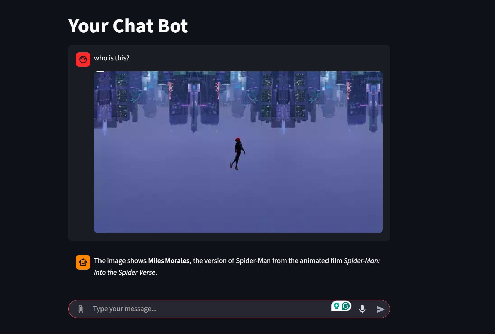
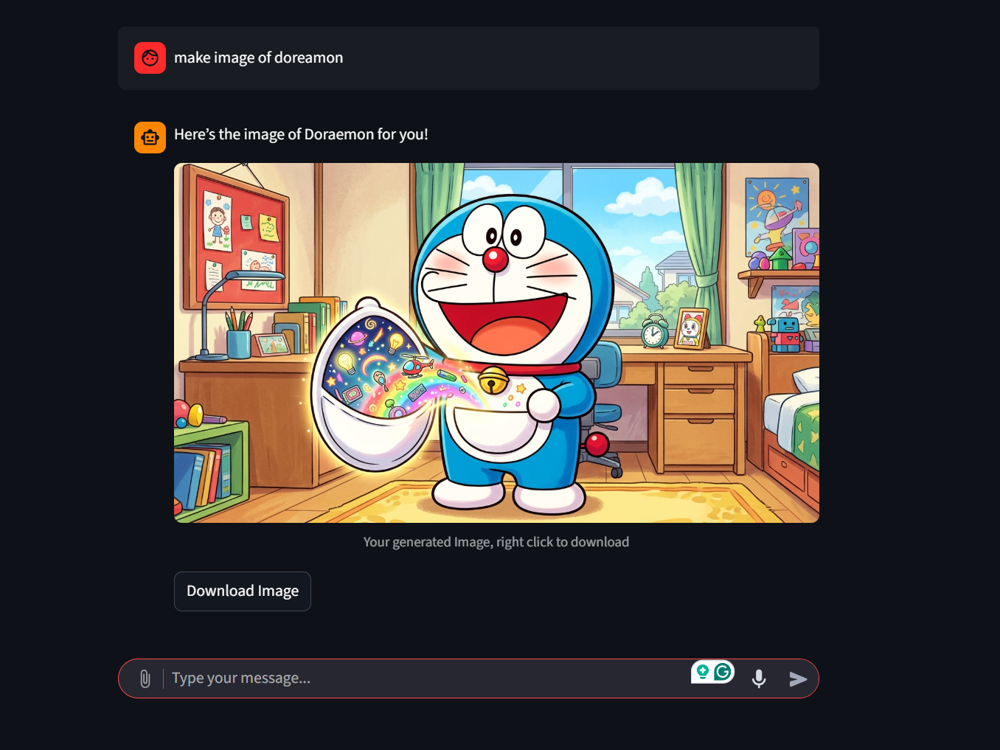

# My-Agent

My very own AI agent, built using openrouter thorugh a **Hackclub** proxy. It includes multiple tools to make it really agentic. Some include a search tool, a file reading tool, a tool to let it run python code, and an image generation tool. It has even more features, scroll down to see all of them. 

Right now, If you want to clone it and run it, you won't be able to unless you are a Hack Club member, but I will be making it public in the future by making it use OpenRouter directly rather than using the Hack Club proxy. 

<details><summary>Click here to see more information about Hack Club</summary>

> If you are wondering what Hack Club is, it's a non-profit organization that provides free resources and support for high school coding clubs around the world, and regularly host hackathons/online programs. They also provide a proxy for openrouter with $3 of credit per day, which is what I used to build this agent. They also provide a brave search api key for free, which is what I used for the search tool. If you are interested in joining Hack Club, you can check out their website [here](https://hackclub.com/).

</details>


<details><summary>Disclaimer:</summary>

> This project was more of a learning experience for me, admittedly it does have some kinks and bugs, but the main structure is there. Please feel free to contribute and make it better, or if you have any suggestions please let me know.

</details>

<br>

## Image of the project




## Features/tools

The AI agent is built using python and langchain. The main way I made it agentic is through giving it multiple tools. Making it **WAY** smarter and more capable. Before I list all the tools, I want to tell you that the agent isn't just 1 AI, but **6** ! Why? Well, the main AI(gpt 20b) is really good for general tasks, and calling tools, but not for specific needs which the user might need. For this exact reason, I included 5 other AI's which are:

- **poolside/laguna-xs.2:free**: for coding tasks, it has the best balance between speed and good code + it's free

- **openai/gpt-oss-120b:free**: for reasoning tasks, from my testing, it's the best free model for reasoning

- **z-ai/glm-4.5-air:free**: for creative tasks, it's the best free model for creative tasks, like writing stories, poems, etc

- **nvidia/nemotron-nano-12b-v2-vl:free**: for vision tasks; first vision AI I found 😅

- **google/gemini-3.1-flash-image-preview**: for image generation; this is the only paid model, because there are NO free AI generation models on openrouter. It's the cheapest/best image generation model I found on openrouter, so I went with it.

That conculdes the different AI's the agent can use, now let's get into the tools at it's disposal it can use:


- **Search**: Pretty self explanitory, searches the web; It uses the brave search API, but if that isn't working for some reason, it automatically switches to duck duck go search, which is free.

- **Read File**: It can read files if the user uploads a path to a file, if the file is to large, it uses the python tool to analyze the file in chunks.

- **Read Folder**: It can read folders, and see what files are in them, which is really useful for the agent to see the files/seperation of folders and files in a user's project. Only works if user provides folder path/

- **Python Tool**: It can run python code, which is really useful for doing calculations, analyzing data, or even just running code that the user gives it. This basically makes the agent able to do anything python can do, which is a lot of things.


That concludes the tools the agent can use, now let's talk about the UI of the project. The project uses **Streamlit** for the UI, you can upload files, and talk to the agent all through the UI. 

Now finally, let's talk about the agent's system prompt, the system prompt is carefully crafted using me/claude/and random smart engineers on the internet. The system prompt basically tells the agent about the tools it has and how to use them. It also tells the agent to not overcomplicate code. Like if the user asks it to write a function that adds 2 numbers, it shouldn't write a 100 line code with classes and stuff, but rather a simple function that adds 2 numbers. The system prompt also tells the agent to use the different AI's for different tasks, which I mentioned earlier.

## How to set it up (Right now, only for Hack Club members)

1. Clone the repo and cd into it

```bash
git clone https://github.com/hqwn/my-agent
cd my-agent
```

2. Install the requirements

```bash
pip install -r requirements.txt
```

3. Clone the .env.example file and fill in the required API keys. If you are a Hack Club member, you can get the API keys for free from these websites.

- AI API key: https://ai.hackclub.com/

- Brave Search API key: https://search.hackclub.com/

```bash
cp .env.example .env
```
REMEMBER TO FILL IN THE API KEYS IN THE .env FILE (AI API key required, but BRAVE SEARCH API key isn't required, if not provided, it will automatically switch to duck duck go search which is free)

4. Run the streamlit app

```bash
python -m streamlit run python/ui.py
```

## Links

- YouTube Channel: https://www.youtube.com/@RuCode

- LinkedIn: https://www.linkedin.com/in/aryan-jain-085401344/

- Gmail: aryanjain9818@gmail.com

- More Projects: Check my GitHub profile

## More Images


